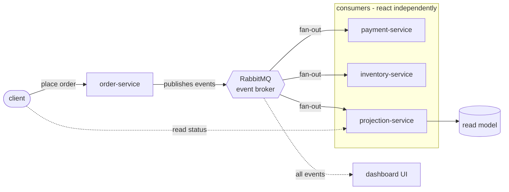

# Event-driven architecture - demo

A tiny, runnable example of event-driven architecture. When you place an order, that fact is published as an **event**, and separate services react to it on their own. No service calls another directly. It runs on your laptop with Docker, no cloud.



## The idea

- **Events are facts.** Something happened, named in the past tense: `orders.placed`.
- **The producer doesn't know who's listening.** order-service just publishes the event. It never calls payment or inventory.
- **Consumers react on their own.** Payment and inventory both handle the same event, independently. You can add or remove a consumer without touching anyone else.

That last point - services staying independent - is the whole reason to go event-driven.

## The pieces

- **RabbitMQ** - the broker every event flows through.
- **[order-service](order_service.py)** - takes an order over HTTP, publishes `orders.placed`.
- **[payment-service](payment_service.py)** - reacts, publishes `payments.captured`.
- **[inventory-service](inventory_service.py)** - reacts, publishes `inventory.reserved`.
- **[projection-service](projection_service.py)** - listens to all three and keeps an order-status view in Postgres, served over HTTP.
- **[dashboard](dashboard.py)** - a live web view of the whole system, subscribing to every event.

## Run it

Needs Docker.

```bash
make up      # start RabbitMQ, Postgres, and the four services
make demo    # place an order and watch it reach CONFIRMED
make logs    # watch the events flow between services
make down    # stop everything
```

- **Live dashboard: <http://localhost:8002>** - place orders and watch the components light up as events flow
- See the read model: <http://localhost:8001/orders>
- Watch the broker (queues, messages): <http://localhost:15672> (guest / guest)

## Core concepts

Every event-driven system has these, however simple or complex:

1. **Event** - a record of something that happened.
2. **Producer** - publishes events, addresses no one in particular.
3. **Broker** - carries events from producers to consumers (RabbitMQ here).
4. **Consumer** - reacts to the events it cares about.

Plus two rules that make it "event-driven": producers and consumers are **decoupled** (they only know the broker, not each other), and it's **asynchronous** (publish and move on, don't wait for a reply).

## Built for an MVP

Beyond the bare pattern, this includes the few things a real MVP shouldn't skip:

- **Structured events** - every event carries a `type`, `id`, `time`, and `correlation_id`, not just a payload.
- **Correlation id** - threaded through the whole flow, so you can follow one order across every service in the logs (look for `[corr=...]`).
- **Idempotent payments** - payment-service records each event id it handles (in Postgres), so a redelivered event never double-charges.
- **Dead-letter queue** - a message the handler can't process goes to a `dead-letter` queue instead of vanishing or blocking the line. Try it: order an item named `POISON`.

## Going further

Still left out on purpose, add when the problem calls for it: formal event schemas and versioning, distributed tracing (OpenTelemetry), orchestration / sagas for multi-step workflows, and high-availability clustering.

## Tests

```bash
python test_logic.py    # checks the order-status rules, no broker needed
```
